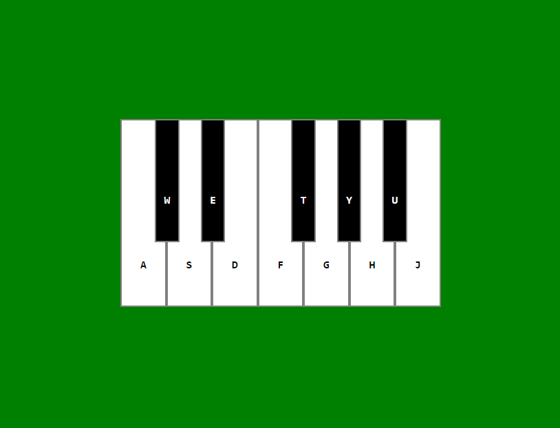

# Hyperskill-JavaScript-Piano
A simple Website for creating a Piano that can be played on key press, as part of the Hyperskill React/ JavaScript course from Jetbrains.

A simpliefied version that plays the sounds like a keyboard can be viewed here: 
https://mzak2.github.io/Hyperskill-JavaScript-Piano/ 
 

Here is an example of the site (sound not included!): 

 
